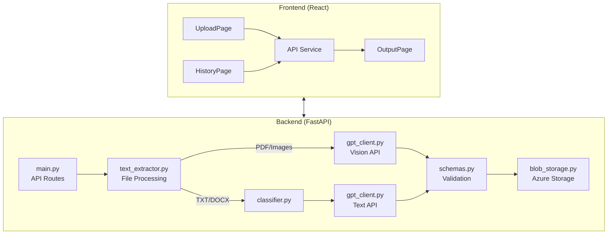
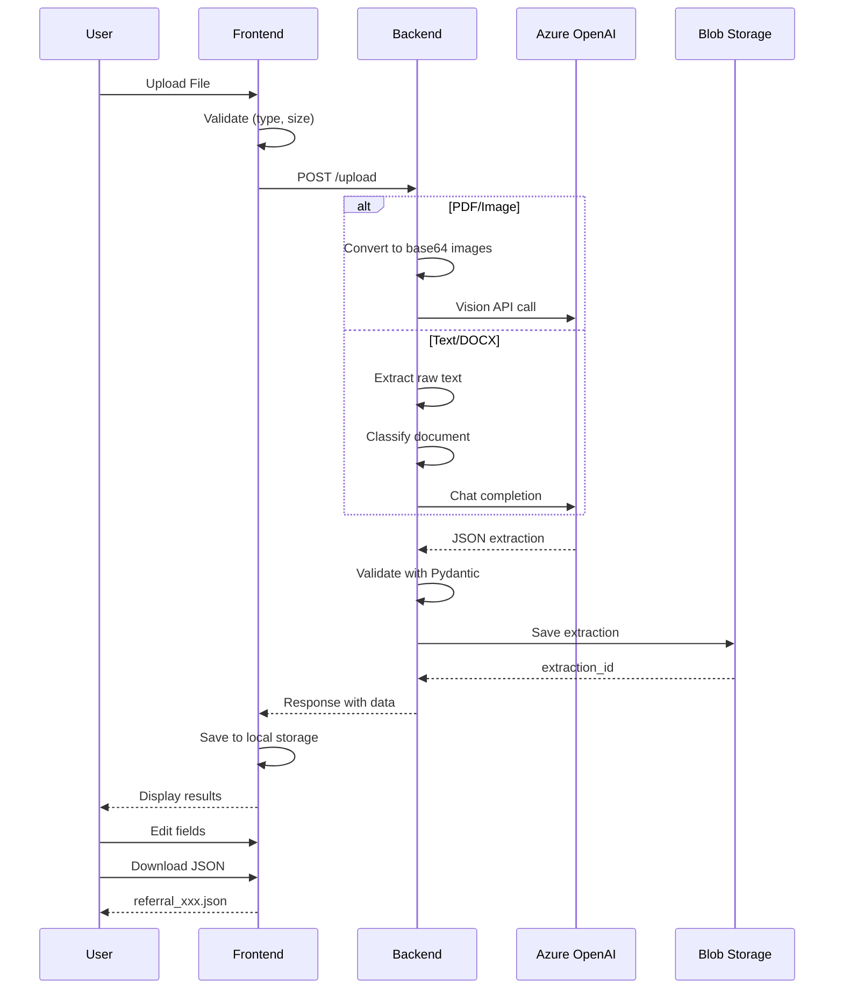

# Medical Referral Fax Extractor - Workflow Documentation

## Overview

This document explains how files are processed and how each code component works in the ZEN-AI Medical Referral Fax Extractor application.

---

## Architecture Diagram



---

## File Processing Flow

### Step 1: User Uploads File

**Frontend:** `UploadPage.jsx`

```javascript
// User drops/selects file → validation → upload to backend
const handleUpload = async () => {
  const result = await uploadFile(selectedFile, onProgress);
  saveToHistory(result);        // Save to local storage
  setCurrentResult(result);      // Pass to OutputPage
  navigate('/output');           // Navigate to results
};
```

**What happens:**
1. File validated (extension + size check)
2. FormData created with file
3. POST request sent to `/upload` endpoint
4. Progress tracked via axios callbacks

---

### Step 2: Backend Receives File

**Backend:** `main.py` → `/upload` endpoint

```python
@app.post("/upload")
async def upload_file(file: UploadFile = File(...)):
    # 1. Validate extension
    ext = Path(filename).suffix.lower()
    if ext not in SUPPORTED_EXTENSIONS:
        raise HTTPException(status_code=400)
    
    # 2. Validate file size (max 50MB)
    if file_size > MAX_FILE_SIZE:
        raise HTTPException(status_code=400)
    
    # 3. Extract content based on file type
    content_data = extract_with_metadata(file)
```

---

### Step 3: Content Extraction

**Backend:** `text_extractor.py`

The extractor routes files to the appropriate processing method:

| File Type | Processing Method | Output |
|-----------|------------------|--------|
| PDF | `pdf_to_images_base64()` | List of base64 images |
| JPG/PNG | `image_to_base64()` | Single base64 image |
| TXT | `extract_text_from_txt()` | Raw text string |
| DOCX | `extract_text_from_docx()` | Raw text string |

```python
def extract_with_metadata(file: UploadFile) -> Dict[str, Any]:
    # Visual formats → images for Vision API
    if file_ext in ['.pdf', '.jpg', '.jpeg', '.png']:
        images = extract_images_from_file(tmp_path)
        return {"type": "images", "images_base64": images}
    
    # Text formats → raw text for LLM
    elif file_ext in ['.txt', '.docx']:
        text = extract_text_from_file(tmp_path)
        return {"type": "text", "raw_text": text}
```

**PDF to Image conversion:** Uses PyMuPDF (fitz) to render each page at 150 DPI.

---

### Step 4: AI Extraction

**Backend:** `gpt_client.py`

Two extraction paths:

#### Path A: Images (PDF, JPG, PNG)

```python
def extract_referral_from_images(images_base64: list, schema: Dict) -> Dict:
    # Build Vision API request with all images
    content = []
    for img_b64 in images_base64:
        content.append({
            "type": "image_url",
            "image_url": {"url": f"data:image/png;base64,{img_b64}"}
        })
    
    # Call Azure OpenAI Vision
    resp = client.chat.completions.create(
        model=AZURE_OPENAI_DEPLOYMENT,
        messages=[
            {"role": "system", "content": system_prompt},
            {"role": "user", "content": content}
        ],
        max_tokens=2000,
        temperature=0.0  # Deterministic output
    )
```

#### Path B: Text (TXT, DOCX)

```python
def extract_referral_from_text(raw_text: str, schema: Dict) -> Dict:
    # Truncate to prevent token overflow
    user_prompt = f"""
    SCHEMA: {json.dumps(schema)}
    DOCUMENT TEXT: {raw_text[:8000]}  # Max 8000 chars
    """
    
    # Call Azure OpenAI
    resp = client.chat.completions.create(...)
```

**Cost optimization:**
- Temperature 0.0 = no randomness (cheaper)
- max_tokens = 2000 (reasonable limit)
- Text truncated to 8000 chars
- Uses gpt-4o-mini (cost-effective model)

---

### Step 5: Classification (Text Only)

**Backend:** `classifier.py`

For text documents, classification determines if it's a referral:

```python
class ReferralClassifier:
    STRONG_KEYWORDS = ['referral', 'referring', 'referred to', ...]
    MEDICAL_KEYWORDS = ['patient', 'diagnosis', 'treatment', ...]
    
    def classify(self, text: str) -> Dict:
        # Count keyword matches
        strong_count = self._count_keywords(text, self.STRONG_KEYWORDS)
        medical_count = self._count_keywords(text, self.MEDICAL_KEYWORDS)
        
        # Calculate score (strong=10pts, medical=2pts, etc.)
        score = strong_count * 10 + medical_count * 2 + ...
        
        # Determine classification
        is_referral = strong_count >= 1 and score >= 10
        confidence = min(score / 50.0, 1.0)
        
        return {'is_referral': is_referral, 'confidence': confidence}
```

---

### Step 6: Schema Validation

**Backend:** `schemas.py`

Pydantic models validate the extracted data:

```python
class ReferralExtraction(BaseModel):
    document_meta: DocumentMeta
    referral: ReferralInfo
    patient: PatientInfo
    diagnoses: Optional[Diagnoses]
    treatments: Optional[List[str]]
    reason_for_referral: Optional[str]
    # ... more fields
```

---

### Step 7: Storage

**Backend:** `blob_storage.py`

Results saved to Azure Blob Storage:

```python
def save_extraction(self, extracted_data, filename, text_stats):
    extraction_id = str(uuid.uuid4())
    
    result = {
        "extraction_id": extraction_id,
        "filename": filename,
        "timestamp": datetime.now().isoformat(),
        "extracted_data": extracted_data
    }
    
    blob_client.upload_blob(
        json.dumps(result),
        content_settings=ContentSettings(content_type='application/json')
    )
    
    return extraction_id
```

---

### Step 8: Response to Frontend

```python
return {
    "extraction_id": extraction_id,
    "classification": classification,
    "text_stats": text_stats,
    "extracted": validated.dict()
}
```

---

### Step 9: Display Results

**Frontend:** `OutputPage.jsx`

```javascript
const OutputPage = ({ result, uploadedFile }) => {
  // Editable fields for review
  const [editedData, setEditedData] = useState(result.extracted);
  
  // Nested path updates (e.g., "patient.full_name")
  const handleInputChange = (path, value) => {
    const pathArray = path.split('.');
    // Deep update the nested object
  };
  
  // Export functionality
  const downloadJSON = () => {
    const dataBlob = new Blob([JSON.stringify(editedData)]);
    // Trigger download
  };
};
```

---

## Backend Module Summary

| Module | Purpose | Key Functions |
|--------|---------|---------------|
| [main.py](file:///e:/new%20downloads/Projects/intern%20react/Fax%20Ref/backend/app/main.py) | API routes, CORS, error handling | `upload_file()`, `get_history()` |
| [text_extractor.py](file:///e:/new%20downloads/Projects/intern%20react/Fax%20Ref/backend/app/text_extractor.py) | File → content conversion | `extract_with_metadata()`, `pdf_to_images_base64()` |
| [gpt_client.py](file:///e:/new%20downloads/Projects/intern%20react/Fax%20Ref/backend/app/gpt_client.py) | Azure OpenAI integration | `extract_referral_from_text()`, `extract_referral_from_images()` |
| [classifier.py](file:///e:/new%20downloads/Projects/intern%20react/Fax%20Ref/backend/app/classifier.py) | Document classification | `classify_document()` |
| [blob_storage.py](file:///e:/new%20downloads/Projects/intern%20react/Fax%20Ref/backend/app/blob_storage.py) | Azure Blob Storage | `save_extraction()`, `list_extractions()` |
| [schemas.py](file:///e:/new%20downloads/Projects/intern%20react/Fax%20Ref/backend/app/schemas.py) | Pydantic validation | `ReferralExtraction` model |
| [config.py](file:///e:/new%20downloads/Projects/intern%20react/Fax%20Ref/backend/app/config.py) | Environment config | `AZURE_OPENAI_*`, `UPLOAD_DIR` |
| [log.py](file:///e:/new%20downloads/Projects/intern%20react/Fax%20Ref/backend/app/log.py) | Logging setup | `logger` instance |
| [json_schema.py](file:///e:/new%20downloads/Projects/intern%20react/Fax%20Ref/backend/app/json_schema.py) | LLM output schema | `JSON_SCHEMA` dict |

---

## Frontend Component Summary

| Component | Purpose | Key Features |
|-----------|---------|--------------|
| [App.jsx](file:///e:/new%20downloads/Projects/intern%20react/Fax%20Ref/client/src/App.jsx) | Root router | Routes, state management |
| [HomePage.jsx](file:///e:/new%20downloads/Projects/intern%20react/Fax%20Ref/client/src/components/HomePage.jsx) | Landing page | Features, how-it-works |
| [UploadPage.jsx](file:///e:/new%20downloads/Projects/intern%20react/Fax%20Ref/client/src/components/UploadPage.jsx) | File upload UI | Drag-drop, validation, progress |
| [OutputPage.jsx](file:///e:/new%20downloads/Projects/intern%20react/Fax%20Ref/client/src/components/OutputPage.jsx) | Results display | Editable fields, JSON export |
| [HistoryPage.jsx](file:///e:/new%20downloads/Projects/intern%20react/Fax%20Ref/client/src/components/HistoryPage.jsx) | History list | Search, download, stats |
| [Navbar.jsx](file:///e:/new%20downloads/Projects/intern%20react/Fax%20Ref/client/src/components/Navbar.jsx) | Navigation | Active route highlighting |
| [api.js](file:///e:/new%20downloads/Projects/intern%20react/Fax%20Ref/client/src/services/api.js) | API client | `uploadFile()`, `fetchHistory()` |
| [storage.js](file:///e:/new%20downloads/Projects/intern%20react/Fax%20Ref/client/src/services/storage.js) | Local storage | `saveToHistory()`, `getHistory()` |

---

## Complete Flow Diagram



---

## Cleanup Changes Made

| Category | Files Changed | Action |
|----------|--------------|--------|
| **Deleted** | 4 test scripts | Removed development utilities |
| **Backend** | `config.py`, `utils.py`, `main.py`, `log.py` | Removed legacy code, fixed duplicates |
| **Frontend** | 6 components + services | Removed debug logs and separators |

All changes were cleanup-only with **no functional changes** to the application logic.
